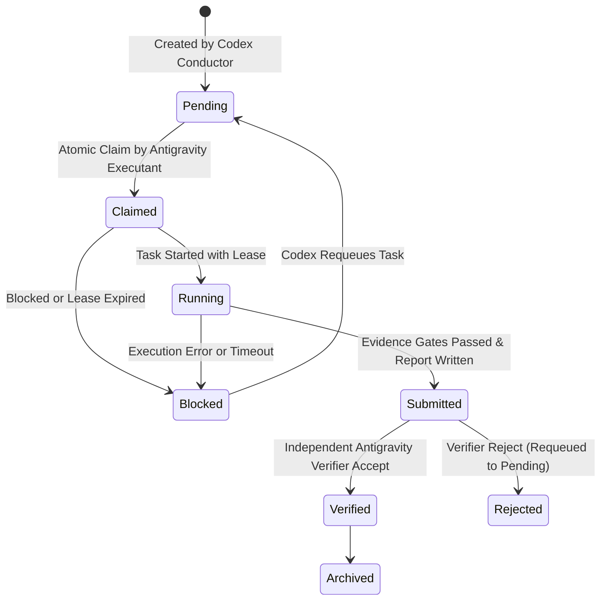

# Cogni-OS Multi-Agent Ensemble Rules & Governance Protocol

Cogni-OS는 **Codex (지휘자 / Conductor)**와 **Antigravity (멀티에이전트 수행자 & 독립 검증자)** 간의 증거 기반 불변 원장(Evidence-First Ledger) 협업 프로토콜입니다.

---

## 1. Roles & Separation of Duties

### 👑 Codex (Orchestrator / Conductor)
- **Role**: 전체 시스템의 지휘자(Conductor) 및 오케스트레이터.
- **Responsibilities**:
  1. 전체 작업 분할(Task Decomposition) 및 태스크 생성 (`cogni task add`).
  2. 태스크 소유권 할당 및 스케줄링.
  3. 에이전트 간 권한/게이트 설정 (GPU, 네트워크, 검증 게이트).
  4. 증거 원장 총괄 및 최종 릴리스/커밋 승인 권한 독점.
- **Rules**: 코드 직접 수정 대신 앙상블 시스템 전체를 지휘 및 검증 상태를 최종 컨트롤합니다.

### ⚡ Antigravity-1 & Antigravity-2 (Primary & Sub-Executants)
- **Role**: 멀티에이전트 코드 수행자 (Executants / Workers).
- **Responsibilities**:
  1. 원자적 락을 선점하여 태스크 Claim (`cogni task claim`, `cogni task start`).
  2. 기능 구현, 단위 테스트 작성, 리팩토링 및 린트 검사 수행.
  3. 6개 필수 섹션 보고서 (`.md`) 및 SHA-256 증거 매니페스트 (`.evidence.json`) 생성 후 제출 (`cogni task submit`).
- **Rules**: 자신에게 할당된 허용 범위(`allowed_write_roots`) 내에서만 파일 작성을 수행합니다.

### 🛡️ Antigravity-Verifier (Independent Reviewer & Advisor)
- **Role**: 독립된 환경의 품질 및 안전성 검증자 (Verifier / Advisor).
- **Responsibilities**:
  1. 수행자(Worker)와 독립된 환경에서 known-answer test, lint, 보안 감사를 재수행.
  2. 검증 결과를 불변 원장에 기록 (`cogni task verify --decision accept/reject`).
- **Rules**: 수행자와 동일한 모델/컨텍스트가 아닌 독립적 검증을 거친 항목만 `VERIFIED`로 승인합니다.

---

## 2. Task State Machine Transitions

---

## 3. Human & Safety Boundaries

1. **불변 증거 원장 (Immutable Evidence Ledger)**: 모든 작업 상태 변경은 SHA-256 및 HMAC 서명 기반의 `events.jsonl`에 기록됩니다.
2. **자동 진행률 관제 (Live Monitoring)**: 사용자는 Cloudflare 배포 대시보드 (`public/index.html`)를 통해 실시간으로 작업 진행률, 에이전트 카드, 원장 증거 타임라인을 모니터링할 수 있습니다.
3. **독립 검증 필수 (Independent Verification)**: 작업자가 제출(`SUBMITTED`)한 결과물은 독립 검증자의 재현성 확인이 완료되어야만 최종 `VERIFIED` 상태가 됩니다.
