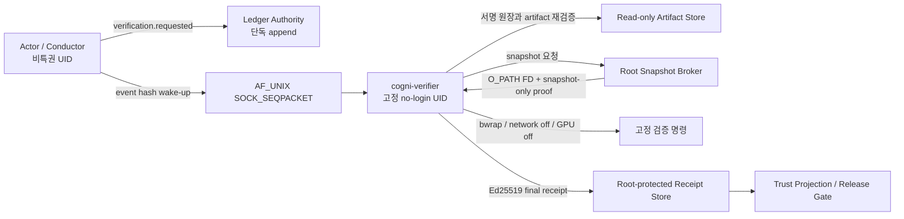

# Cogni-OS 독립 검증 서비스 아키텍처

상태: **설계 확정 / 휴대형 프로토콜·receipt·보존 계층 구현 / 운영 서비스·Linux E2E 미완료 / Phase 1 NO_GO**

이 문서는 snapshot broker의 root 서명을 검증 명령 실행 증거로 잘못
승격할 수 있었던 signing-oracle 결함을 제거하고, Cogni-OS의 독립 재현
검증을 운영 가능한 서비스 경계로 구현하기 위한 고정 계약이다.

## 1. 신뢰 경계

세 서명 영역은 서로 다른 Ed25519 키와 domain을 사용한다.

| 영역 | 서명 domain | 증명 범위 |
|---|---|---|
| Ledger Authority | `cogni-os.ledger-event.v2` | 요청·상태 전이의 append 권한 |
| Snapshot Broker | `cogni-os.snapshot-proof.v1` | 커밋 snapshot 생성, FD 임대, namespace 정리 |
| Dedicated Verifier | `cogni-os.verification-receipt.v1` | 실제 명령·출력·결과·runtime의 독립 실행 |

Snapshot Broker에는 `passed`, `verified`, `test_result` 같은 실행 판정 필드가
존재해서는 안 된다. Broker 서명만 있는 receipt는 항상 `NO_GO`다.

## 2. 운영 구성



소켓 메시지는 권한이 아니라 wake-up 신호다. 서비스는 소켓에서 받은
경로나 명령을 실행하지 않고, Ledger Authority가 서명한 정확한
`verification.requested` 이벤트를 다시 읽어 모든 입력을 결정한다.

## 3. 입력 불변식

검증 서비스는 actor의 현재 working tree를 실행 입력으로 사용하지 않는다.
다음 content-addressed artifact만 허용한다.

- 보존된 Git bundle과 정확한 commit/tree OID
- 독립적으로 보존된 verifier manifest
- 발급자 서명과 SHA-256이 결합된 validation contract
- task, attempt, run ID, 권한, nonce, 만료 시각이 결합된 요청 이벤트

Artifact는 `dirfd`와 `openat2(RESOLVE_BENEATH|NO_SYMLINKS)` 또는 동등한
fail-closed 경로 검사를 통해 읽는다. 각 파일은 크기 상한과 SHA-256을 다시
측정한다. Shell 실행은 금지하며 고정 executable digest, argv, cwd, env만
허용한다.

## 4. 전용 서비스 계정

```text
cogni-verifier:x:<fixed>:<fixed>::/var/lib/cogni-os/verifier:/usr/sbin/nologin
```

- runtime: `/opt/cogni-os/verifier/<release-id>/`, root:root, directory `0555`
- service private key: root:`cogni-verifier` `0640`
- ledger/artifact/public key: read-only
- writable: `/var/lib/cogni-os/verifier`, `/run/cogni-os/verifier`만 허용
- 일반 actor와 일반 사용자를 `cogni-verifier` 또는 broker 권한 그룹에
  등록하지 않는다.

고정 entrypoint, interpreter, package tree, service unit, policy file의 digest를
하나의 root-owned runtime manifest에 결합해야 한다.

## 5. 일회성 dispatch

권한의 원본은 다음 항목을 포함한 서명 이벤트다.

- workspace ID, task ID, attempt, 32-hex run ID
- source artifact ID, commit OID, tree OID, SHA-256, byte count
- verifier manifest와 validation contract SHA-256
- `network=false`, `gpu=false`
- capability receipt, nonce, issued/expiry

`dispatch_event_hash`는 dispatch ID이며 전역적으로 한 번만 소비한다. 소켓
packet은 이 hash와 task/run/nonce만 전달하고 4 KiB를 넘지 않는다.

## 6. 실행 receipt 결합

Verifier execution preimage는 최소 다음을 포함한다.

- request/start event hash와 ledger head
- task/attempt/run/actor
- source artifact, commit, tree, snapshot manifest
- broker acquire proof hash
- verifier runtime/entrypoint/interpreter/package/service policy digest
- 각 명령의 executable digest, argv, cwd, 고정 환경
- network/GPU 차단 상태와 namespace/cgroup 정보
- exit code, timeout, truncation, stdout/stderr digest와 byte count
- source/snapshot postcheck
- 시작·종료 wall/monotonic time, 구조화된 failure code

Verifier가 execution preimage를 별도 키로 서명한 뒤, Broker cleanup 요청을
동일 preimage hash에 결합한다. 최종 receipt는 execution signature와 cleanup
proof를 함께 포함하며 다시 verifier key로 봉인한다.

## 7. 상태 기계와 복구

```text
REQUESTED -> CLAIMED -> SOURCE_VERIFIED -> SNAPSHOT_ACQUIRED
          -> EXECUTING -> EXECUTION_SEALED -> RELEASE_PENDING
          -> CLEANUP_ACKED -> RECEIPT_PERSISTED -> TERMINAL_APPENDED -> DONE
```

모든 상태는 atomic replace 후 파일과 부모 directory까지 fsync한다.

- `EXECUTING`에서 재시작하면 명령을 다시 실행하지 않고 `crash_aborted`로
  종료한다.
- `EXECUTION_SEALED` 이후에는 같은 preimage로 cleanup과 receipt 저장만
  재개한다.
- Broker release는 bounded tombstone을 사용해 응답 유실 시 같은 cleanup
  proof를 idempotent하게 반환한다.
- 실행 시작 marker는 child spawn 전에 fsync한다.

## 8. systemd 격리 기준

최소 정책:

```ini
User=cogni-verifier
Group=cogni-verifier
NoNewPrivileges=yes
PrivateNetwork=yes
PrivateDevices=yes
DevicePolicy=closed
ProtectSystem=strict
ProtectHome=yes
ProtectKernelTunables=yes
ProtectKernelModules=yes
ProtectControlGroups=yes
ProtectClock=yes
ProtectProc=invisible
MemoryDenyWriteExecute=yes
LockPersonality=yes
RestrictSUIDSGID=yes
RestrictAddressFamilies=AF_UNIX
KillMode=control-group
UMask=0077
```

검증 child는 bwrap `--unshare-all --new-session --die-with-parent`로 실행하고
read-only snapshot `/workspace`와 per-run scratch 외의 writable 경로를
노출하지 않는다. `/dev/nvidia*`는 없어야 하며 `CUDA_VISIBLE_DEVICES=""`,
`NVIDIA_VISIBLE_DEVICES=void`를 강제한다.

## 9. 구현 현황과 필수 파일

- 구현됨: `src/cogni_os/verifier_protocol.py`의 요청·wakeup·receipt exact schema
- 구현됨: `src/cogni_os/verifier_journal.py`의 일회성 dispatch와 crash recovery 상태 기계
- 구현됨: `src/cogni_os/verifier_receipt.py`의 분리된 verifier Ed25519 실행·최종 서명
- 구현됨: `src/cogni_os/verifier_service.py`의 dispatch claim과 cleanup 이후 receipt 영속화
- 구현됨: `src/cogni_os/retained_source.py`의 bounded content-addressed byte 보존 계층
- 구현됨(경계 모듈): `src/cogni_os/ledger_authority_v2.py`의 exact Ed25519 v2
  envelope, canonical SPKI `key_id`, `ledger_id`, 키 영역 분리, full-chain 현재
  head 전용 signed dispatch 검증 API
- 미구현: Ledger Authority append daemon·키 설치/회전, HMAC v1 원장의 실제
  bounded-byte audit-only migration, durable log/checkpoint,
  `workspace.py`·trust projection·release gate terminal/supersession v2 전환
- 미구현: Git bundle object graph·commit/tree 검증과 retained-only materialization
- 미구현: 실제 고정 명령 실행, snapshot broker 연동, bwrap child 격리
- 미구현: `deploy/systemd/cogni-verifier.socket`
- 미구현: `deploy/systemd/cogni-verifier.service`
- 미구현: `scripts/install_verifier_service.sh`
- 미검증: Ubuntu root/systemd/dirfd/bwrap/Ed25519 무-skip E2E

현재 휴대형 단위 테스트 통과는 위 운영 항목의 대체 증거가 아니다. 특히
`retained_source.py`는 바이트 보존과 재해시만 보장하며, Git object graph나
commit/tree 진위를 확인하거나 checkout을 생성하지 않는다.

기존 `workspace.py`, `verification_lifecycle.py`, `trust_projection.py`,
`release_gate.py`, `release_evidence.py`는 이 프로토콜을 요구하도록
fail-closed로 전환한다.

## 10. GO 기준

다음을 모두 만족하기 전에는 Phase 1을 완료 처리하지 않는다.

- Broker 코드와 proof에 validation PASS 의미가 0개
- broker, verifier, ledger 키와 domain 완전 분리
- 일반 actor의 broker/verifier private key 및 전용 UID 접근 불가
- retained source/manifest/contract만 실행
- one-time dispatch와 crash recovery 검증
- receipt가 task/run/commit/tree/snapshot/commands/output/cleanup 전체 결합
- 실제 Ubuntu root/systemd/bwrap/Ed25519 E2E 무-skip 통과
- unsigned, legacy, broker-only, 부분 receipt 전부 release gate에서 거부
- 재현 명령, 로그, rollback 절차, SHA-256 evidence bundle 보존
